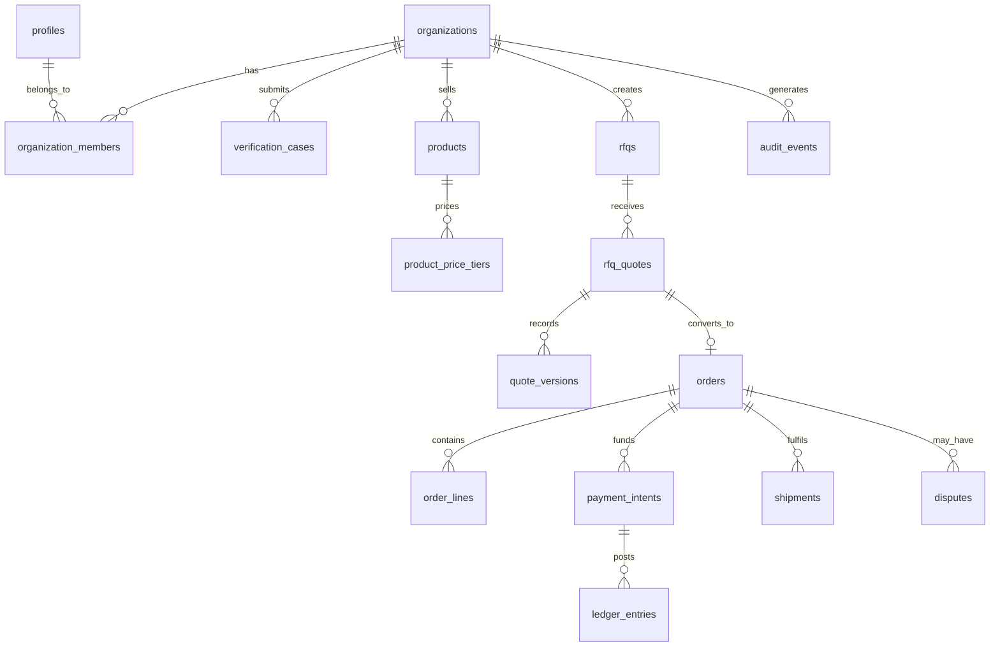

# FEA Bulk architecture baseline

Status: accepted for the first production slices. Last reviewed: 2026-09-20.

## 1. Current repository assessment

The repository is a TanStack Start application on Vite, React 19, TypeScript and Tailwind 4. It contains Supabase client wiring and a linked Supabase project, but no migrations, tables, authentication flows, domain modules, tests, server APIs, CI, Docker environment, or business UI. The only route is a Lovable blank-page placeholder. The generated type file confirms that no database objects have been defined.

Retain TanStack Start for the web application. Use Supabase Auth, PostgreSQL, private Storage, Realtime and Edge Functions as the initial modular TypeScript backend. Keep privileged workflows in Edge Functions and database RPCs; the browser only uses a publishable key. This is a modular monolith, not a set of independently deployed domain services.

## 2. Architecture decision record

| Decision | Rationale | Consequence |
| --- | --- | --- |
| Supabase Postgres is the system of record | It is already linked and provides managed Postgres, Auth, Storage and Realtime | All tenant tables use RLS and migrations are the contract |
| TanStack Start remains the BFF and public web layer | It matches the existing repository and supports SSR and CSRF middleware | Server functions must call Edge Functions for privileged actions |
| Edge Functions own side effects | Payment webhooks, document generation, notifications, virus scans and document signing must not run in browsers | A job-outbox table ensures retryable delivery |
| Postgres full-text search first | It is sufficient for the first catalog scale and avoids premature operational cost | Re-index into OpenSearch only after measured search load requires it |
| Private Supabase Storage for sensitive files | Verification and bank documents must never have public URLs | Signed URLs are short lived and are issued after authorization |
| Append-only audit and financial ledgers | Mutable order rows cannot be a financial record | Corrections are compensating entries, never updates |

## 3. Domain-module map

Identity and organizations; verification; catalog and search; RFQs; quotations; conversations; orders and documents; payments and ledger; fulfilment; disputes; trust and reviews; notifications; operations; audit and configuration. Each module owns its tables, state transitions, policies, events and API surface. Cross-module mutations run in a transaction through a server-side command.

## 4. Database ERD

All domain tables include UUID primary keys, `created_at`, `updated_at`, and organization columns where applicable. RLS predicates derive membership from `organization_members`; user editable metadata is never used for authorization. The detailed initial migration starts with identity, organizations, audit, verification and catalog. Later migrations add transactional modules in delivery order.

## 5. Authorization matrix

| Capability | Owner | Admin | Procurement | Approver | Accountant | Sales | Catalog | Inventory | Warehouse | Viewer | FEA ops |
| --- | --- | --- | --- | --- | --- | --- | --- | --- | --- | --- | --- |
| Manage members and roles | Yes | Yes | No | No | No | No | No | No | No | No | Elevated only |
| Submit verification | Yes | Yes | No | No | No | No | No | No | No | No | Review only |
| Create RFQs and orders | Yes | Yes | Yes | No | No | No | No | No | No | Read | No |
| Approve purchase orders | Yes | Configurable | No | Yes | No | No | No | No | No | Read | No |
| Create catalog listings | Yes | Yes | No | No | No | Yes | Yes | No | No | Read | Moderate |
| Update inventory and shipments | Yes | Yes | No | No | No | Sales only | No | Yes | Yes | Read | Monitor |
| View payouts and invoices | Yes | Yes | No | No | Yes | No | No | No | No | Read | Review |
| Resolve disputes or change permissions | No | No | No | No | No | No | No | No | No | No | Dual-control |

Every command checks organization membership and capability server-side. Elevated operations require an operations role plus a recorded reason; payments, verification approvals and role changes require a second authorization where configured.

## 6–10. State machines

| Entity | States | Transition authority |
| --- | --- | --- |
| RFQ | draft → published → receiving_quotes → evaluation → negotiation → awarded → converted; closed/cancelled terminal | Buyer organization and workflow guards |
| Quote | draft → submitted → revised → accepted/rejected/expired/withdrawn | Seller submits versions; buyer accepts one valid version |
| Order | draft → awaiting_seller_confirmation → awaiting_payment → payment_secured → processing → ready_to_ship → shipped → delivered → inspection → completed; cancelled/disputed/partially_fulfilled/returned | Transition RPC validates current state, quantities and payment facts |
| Payment/payout | initiated → pending → authorized → captured/failed/refunded; payout held → eligible → released/failed/reversed | Verified provider webhook and operations dual control |
| Dispute | opened → evidence_collection → seller_response → fea_review → resolution_proposed → accepted/escalated → resolved | Buyer or seller opens; FEA operations resolves |

The database transition functions use allowed-transition tables and row locking. A transition writes an immutable audit event and outbox event in the same transaction.

## 11. Route map

Public: `/`, `/marketplace`, `/categories/$slug`, `/products/$slug`, `/suppliers/$slug`, `/rfqs`, `/how-bulk-pricing-works`, `/buyer-protection`, `/sell`, `/about`, `/help`, `/terms`, `/privacy`, `/refunds`, `/disputes`.

Authenticated: `/app/select-organization`, `/app/buyer/*`, `/app/seller/*`, `/app/settings/*`.

Operations: `/ops/*`, protected by an operations claim and server-side policy. UI routes are convenience only; APIs enforce the same authorization.

## 12. API contract

Versioned REST endpoints sit behind `/api/v1`. Commands accept an `Idempotency-Key`, return a resource and `request_id`, and validate Zod schemas at the edge. Main resource groups: organizations, verification-cases, products, rfqs, quotes, conversations, orders, documents, payments, shipments, disputes and notifications. OpenAPI is generated from endpoint schemas and published in CI. Provider webhooks only enter `/functions/v1/payment-webhook`, which verifies the raw-body signature before any write.

## 13. Event catalog

`organization.member_added`, `verification.submitted`, `verification.approved`, `product.published`, `rfq.published`, `quote.submitted`, `quote.accepted`, `order.created`, `payment.captured`, `shipment.dispatched`, `delivery.confirmed`, `inspection.completed`, `payout.eligible`, `payout.released`, `dispute.opened`, `dispute.resolved`. The outbox worker dispatches events with a stable event id, exponential retry and a dead-letter status.

## 14. Threat model

Primary threats are tenant data exposure, privilege escalation, payment-webhook forgery/replay, document disclosure, malicious file upload, account takeover, quote/order tampering, duplicate financial commands and operations abuse. Controls are RLS plus command-layer checks, no authorization from `user_metadata`, signed webhook verification and idempotency, private buckets with short signed URLs, scan-before-availability, MFA and session revocation, transition guards, immutable ledger/audit events, rate limits, CSP/security headers, structured PII-redacted logs and dual control for high-risk operations.

## 15. Phased implementation plan

1. Identity, organizations, RBAC, audit and verification.
2. Catalog, images, moderated publishing and paginated search.
3. RFQs, versioned quotes and comparisons.
4. Conversations and structured negotiation conversion.
5. Orders, documents and tax configuration.
6. Provider payment adapter, webhook receiver and ledger.
7. Shipments, delivery and inspection.
8. Disputes, refunds and payout adjustments.
9. Operations, analytics, observability and deployment hardening.

Each phase has a migration, RLS/authorization tests, API tests, UI, audit events, logs and operational dashboards before it is accepted.

## 16. Test strategy

Unit tests cover validation, pricing tiers, tax configuration and transition functions. Integration tests run against ephemeral Supabase/Postgres for RLS, tenant isolation, webhook replay, ledger balancing and outbox idempotency. Playwright covers seller onboarding through delivery, buyer RFQ to PO, payment webhook, disputes and restricted-member denial. Axe and responsive viewport tests run in CI. k6 runs public search, product browsing, RFQ and order-command load profiles. CI runs format, lint, type check, migrations, tests and dependency scanning.

## 17. Deployment architecture

Cloudflare or equivalent serves TanStack Start; Supabase provides Auth, PostgreSQL, Realtime and private Storage; Edge Functions receive trusted integrations; a queue worker processes the outbox; an approved Indian payment provider is integrated through a provider adapter. Secrets are managed by the hosting provider, never in source. Monitoring combines structured logs, error tracking, SLO dashboards and alerts for webhook failures, queue age, failed payouts, auth anomalies and RLS errors. Daily backups and PITR are enabled; quarterly restore tests, a documented rollback to the prior immutable build, and incident runbooks are release gates.

## Assumptions and launch gates

Razorpay, Cashfree, or another provider has not been selected, so no claim of escrow is made. GST, e-invoicing, e-way bill and marketplace settlement logic remain configurable and require Indian legal and tax review before launch. A production launch requires a confirmed payment provider, KYC/verification service, malware-scanning provider, notification providers, data-retention policy, operations staffing and penetration test.
